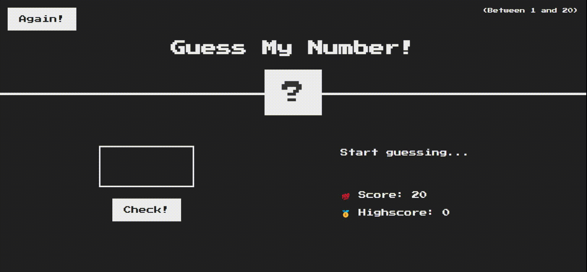

<h1 align="center">Guess My Number</h1>

<h3 align="center">
This is a demo game implemented using HTML, CSS, JAVASCRIPT
</h3>

  You have to guess a number between 1 to 20  
  ↓  
  If your PREDICTED NUMBER is equal to the SECRET NUMBER  
 ↓  
  (̶◉͛‿◉̶) yay ! you won !!! 🏆

<a href="https://alessiopisanoweb.github.io/guess-my-number/">View Demo</a>
·
<a href="https://github.com/alessiopisanoweb/guess-my-number/issues/new">Report Bug</a>
·
<a href="https://github.com/alessiopisanoweb/guess-my-number/issues/new">Request Feature</a>

